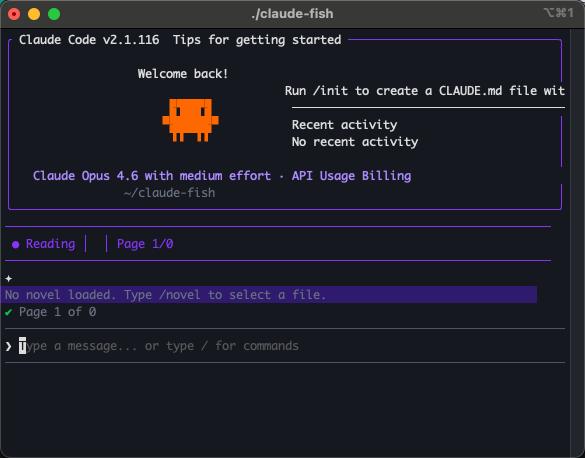
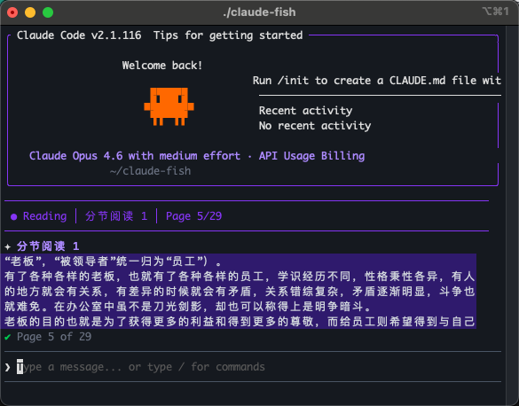
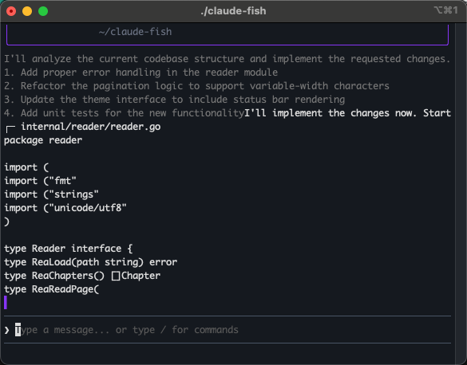
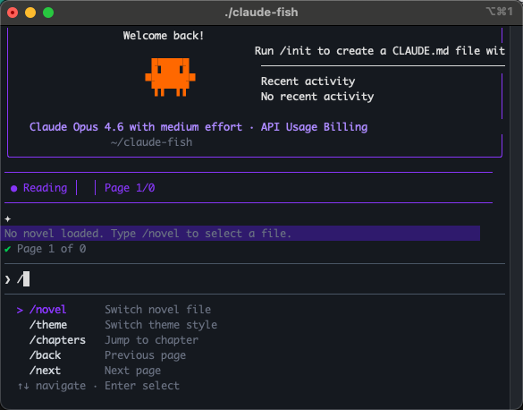
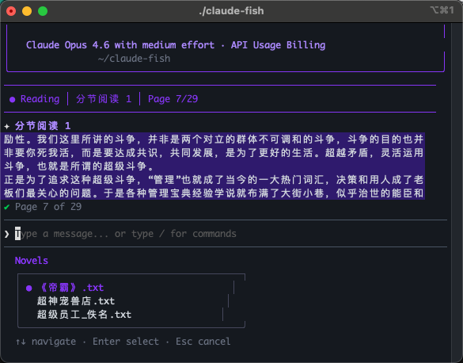
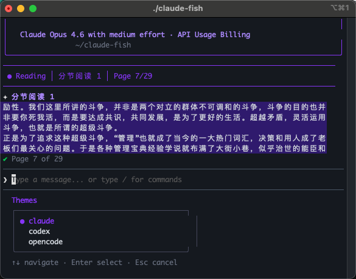
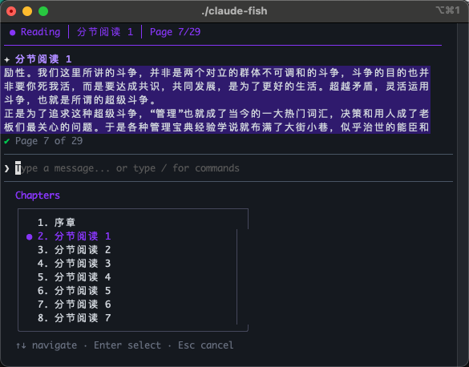

<h1 align="center">claude-fish</h1>

<p align="center">
  一个伪装成 CLI 编程工具的终端小说阅读器<br>
  在终端里看小说，但看起来就像在用 Claude Code 写代码
</p>

<p align="center">
  
  
  
</p>

<p align="center">
  
  
</p>

按 `Tab` 一键切换到「老板模式」，瞬间显示带思考过程和代码的 AI 流式输出，完美防止领导 gank。

<p align="center">
  
</p>

## 功能特点

- **三种 CLI 视觉风格** — Claude Code / Codex CLI / opencode，运行中 `/theme` 随时切换
- **老板键保护** — 按 `Tab` 切换到 AI 代码输出界面，自动循环播放
- **多种小说格式** — 支持 TXT、Markdown、EPUB，自动识别编码（UTF-8 / GBK）
- **智能章节识别** — 中文章节（第X章 / 分节阅读X）和英文章节（Chapter X）
- **阅读历史** — 自动记住位置，下次打开可恢复或跳转章节
- **斜杠命令** — `/novel` `/theme` `/chapters` 等，带自动补全
- **CJK 友好** — 中日韩字符按双宽度计算，排版不截断不乱码
- **单二进制分发** — 零依赖，下载即用，支持 macOS / Linux / Windows

## 安装

### 直接下载

前往 [Releases](https://github.com/tony/claude-fish/releases) 下载对应平台的压缩包，解压后即可运行。

| 平台 | 文件 | 架构 |
|------|------|------|
| macOS | `claude-fish-v*-darwin-arm64.tar.gz` | Apple Silicon (M1/M2/M3/M4) |
| macOS | `claude-fish-v*-darwin-amd64.tar.gz` | Intel |
| Linux | `claude-fish-v*-linux-amd64.tar.gz` | x86_64 |
| Linux | `claude-fish-v*-linux-arm64.tar.gz` | ARM64 |
| Windows | `claude-fish-v*-windows-amd64.zip` | x86_64 |
| Windows | `claude-fish-v*-windows-arm64.zip` | ARM64 |

### 从源码编译

需要 Go 1.24 或更高版本。

```bash
git clone https://github.com/tony/claude-fish.git
cd claude-fish
go build -o claude-fish .
```

### 使用方法

* macOS / Linux: 解压后 一行命令运行

```
./claude-fish 
```


* Windows: 解压后双击 **start.bat** 一键运行，或在终端执行 **claude-fish.exe**

启动后进入 Claude Code 风格界面，输入 `/novel` 选择小说文件开始阅读。

### 交互操作

**阅读模式：**

| 按键 | 功能 |
|:----:|------|
| `Space` | 翻到下一页（输入框为空时生效） |
| `Tab` | 切换到老板模式 |
| `/` | 输入斜杠命令，弹出自动补全 |
| `Esc` | 退出 |

**老板模式：**

| 按键 | 功能 |
|:----:|------|
| `Tab` | 返回阅读模式 |
| `Esc` | 退出 |

### 斜杠命令

<p align="center">
  
</p>

| 命令 | 说明 |
|------|------|
| `/novel` | 选择小说文件 |
| `/theme` | 切换视觉风格 |
| `/chapters` | 跳转到指定章节 |
| `/back` | 上一页 |
| `/next` | 下一页 |

## 功能展示

### 小说选择

输入 `/novel` 打开小说文件选择菜单。

<p align="center">
  
</p>

### 阅读界面

章节标题、小说内容、页码指示一目了然。

<p align="center">
  
</p>

### 主题切换

输入 `/theme` 在三种视觉风格间切换。

<p align="center">
  
</p>

### 章节跳转

输入 `/chapters` 打开章节列表，上下键选择后回车跳转。

<p align="center">
  
</p>

### 老板模式

按 `Tab` 瞬间切换到 AI 编程界面：

1. **AI 思考过程** — 灰色文字显示分析过程
2. **代码文件输出** — 带 `┌─ filename` 标签的代码块，逐字符流式显示
3. **速度波动** — 模拟真实 AI 输出的随机停顿和加速
4. **自动循环** — 输出完毕后自动从头开始

<p align="center">
  
</p>

### 阅读历史

自动将阅读位置保存到 `~/.claude-fish/history.json`。下次打开同一本小说时，可以选择：

- **恢复上次位置** — 跳转到上次阅读的章节和页码
- **从头开始** — 从第一页开始阅读
- **跳转章节** — 打开章节列表选择

## 视觉风格

| 风格 | 说明 |
|------|------|
| **Claude Code**（默认） | 紫色边框，橙色 Logo，模拟 Claude Code v2.1.116 完整界面 |
| **Codex CLI** | 绿色强调色，极简风格，方块进度条 |
| **opencode** | Catppuccin Mocha 配色，顶部 Tab 栏，蓝灰色调 |

## 支持的小说格式

| 格式 | 扩展名 | 说明 |
|------|--------|------|
| 纯文本 | `.txt` | 自动检测 UTF-8 / GBK 编码，识别中文和英文章节标题 |
| Markdown | `.md` `.markdown` | 按 `#` / `##` 标题分章节 |
| EPUB | `.epub` | 标准 EPUB 格式，自动解析 XHTML 内容和章节结构 |

## 项目结构

```
claude-fish/
├── main.go                    # 入口
├── cmd/
│   └── root.go                # CLI 命令定义
├── internal/
│   ├── app.go                 # Bubble Tea 主模型
│   ├── pager.go               # 分页引擎，CJK 双宽度感知
│   ├── boss.go                # 老板模式状态管理
│   ├── boss_content.go        # 内置 AI 输出模拟内容
│   ├── streamer.go            # 多段流式输出引擎
│   ├── history.go             # 阅读历史持久化
│   ├── theme/
│   │   ├── theme.go           # Theme 接口
│   │   ├── claudecode.go      # Claude Code 风格
│   │   ├── codex.go           # Codex CLI 风格
│   │   └── opencode.go        # opencode 风格
│   └── reader/
│       ├── reader.go          # Reader 接口
│       ├── txt.go             # TXT 解析器（GBK/UTF-8）
│       ├── markdown.go        # Markdown 解析器
│       └── epub.go            # EPUB 解析器
├── novel/                     # 示例小说目录
├── picture/                   # 截图
└── build.sh                   # 跨平台构建脚本
```

## 技术栈

| 库 | 用途 |
|----|------|
| [Bubble Tea](https://github.com/charmbracelet/bubbletea) | TUI 框架 |
| [Lip Gloss](https://github.com/charmbracelet/lipgloss) | 终端样式渲染 |
| [Bubbles](https://github.com/charmbracelet/bubbles) | 文本输入组件 |
| [Cobra](https://github.com/spf13/cobra) | CLI 命令解析 |
| [golang.org/x/text](https://pkg.go.dev/golang.org/x/text) | GBK 编码解码 |

## 构建

```bash
# 构建当前平台
go build -o claude-fish .

# 跨平台打包（生成 dist/ 目录下的 6 个压缩包）
bash build.sh
```

## License

本项目使用自定义许可证：**ACNL v1.0**（见 [LICENSE](LICENSE)）。

> 注意：该许可证为自定义许可证，**不是 OSI 标准开源许可证**。

你可以做什么：

- 使用本项目代码（个人或组织均可）
- 修改代码并创建衍生版本
- 重新分发原版或修改版

你必须遵守：

- 必须保留原作者署名（TonyZhang）和许可证文本
- 如果分发了修改版，必须明确标注你做过修改
- 如果要商用，必须事先告知作者（说明产品/场景/联系方式）

你不能做什么：

- 删除或隐藏原作者署名后再发布
- 未告知作者就直接进行商业化使用
- 以任何方式暗示原作者对你的修改版提供担保
